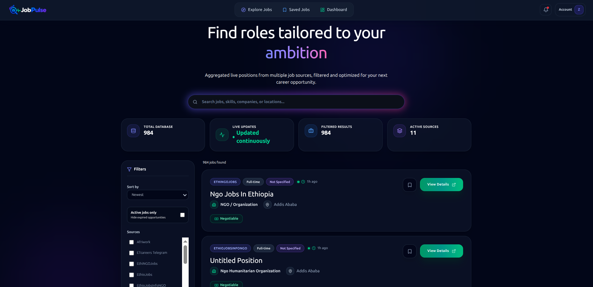
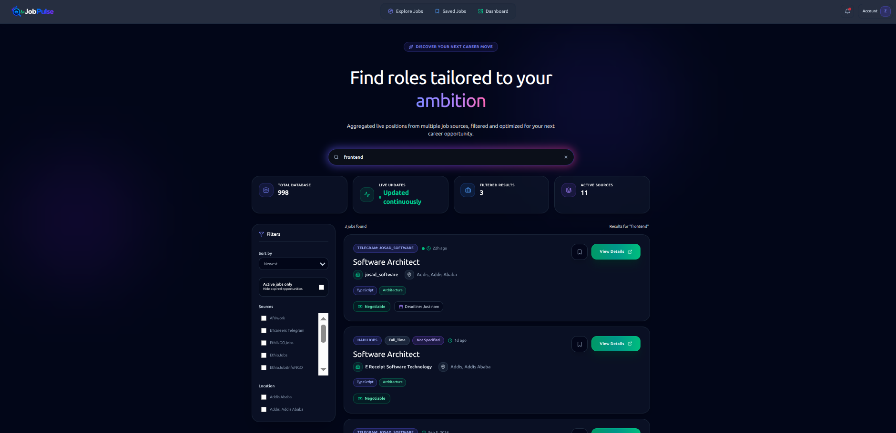
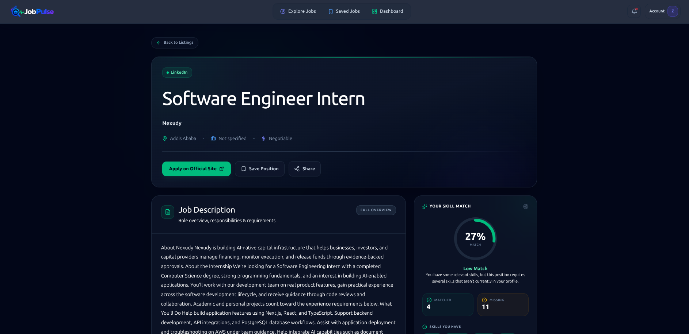
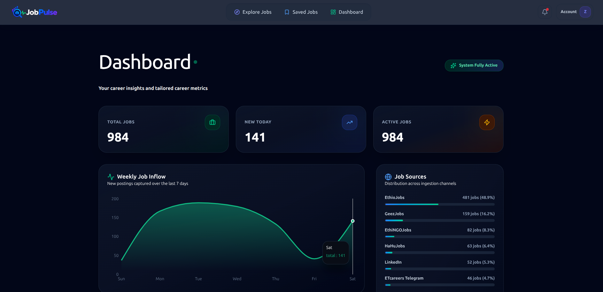
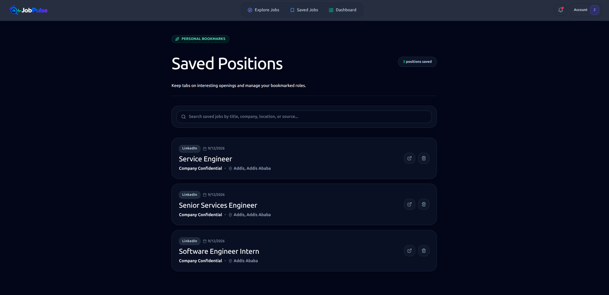
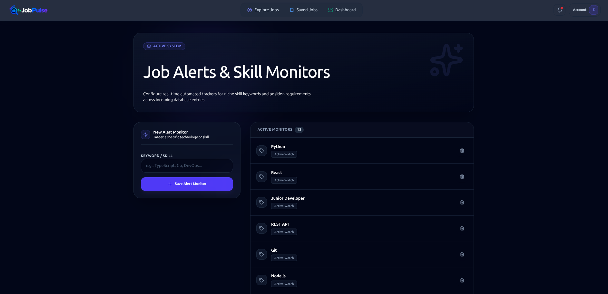
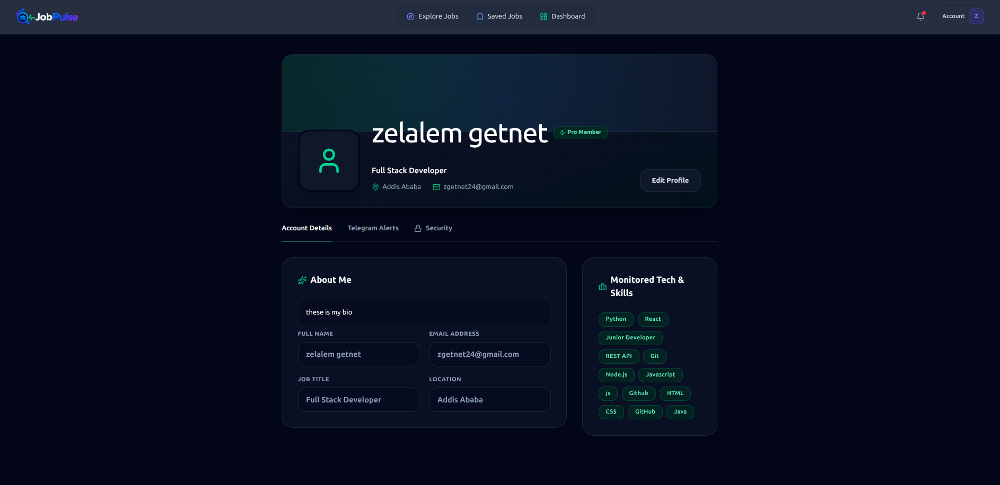
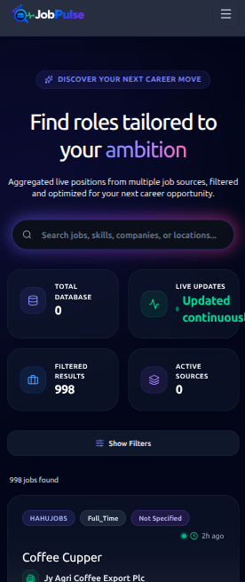

# JobPulse 🔍💼

### Intelligent Job Aggregation, Search & Recommendation Platform

**JobPulse** is a full-stack job intelligence platform that collects job opportunities from multiple websites, job boards, and Telegram sources, normalizes and deduplicates the data, extracts technical skills, stores the results in PostgreSQL, and makes them searchable through a React application.

The platform also provides personalized recommendations, saved jobs, job alerts, analytics, email notifications, and Telegram integrations.

> **Collect → Normalize → Deduplicate → Analyze → Store → Search → Recommend → Notify**

[](https://job-pulse-five.vercel.app/)
[](https://github.com/zelalem3/JobPulse)
[](LICENSE)

---

# 📌 Overview

Job opportunities are distributed across many sources:

* Ethiopian job boards
* Regional career websites
* Remote job platforms
* Telegram channels
* Other structured and semi-structured sources

Finding relevant opportunities manually is time-consuming, and the same job can appear on several platforms with different formatting.

JobPulse solves this by creating a centralized job intelligence pipeline.

Instead of simply scraping and displaying jobs, the system processes each listing through several stages:

```text
External Sources
       │
       ▼
Python Scrapers
       │
       ▼
Normalization
       │
       ▼
Validation
       │
       ▼
Deduplication
       │
       ▼
Skill Extraction
       │
       ▼
PostgreSQL
       │
       ├───────────────┐
       ▼               ▼
    Search       Recommendations
       │               │
       └───────┬───────┘
               ▼
        Laravel API
               │
               ▼
      React + TypeScript
               │
        ┌──────┴──────┐
        ▼             ▼
      Users      Notifications
                    │
             ┌──────┴──────┐
             ▼             ▼
           Email        Telegram
```

---

# ✨ Core Features

## 🔎 Job Discovery

* Aggregated jobs from multiple sources
* Searchable job listings
* Location filtering
* Source filtering
* Employment type filtering
* Experience-level filtering
* Category filtering
* Paginated results
* Detailed job pages
* Company information
* Requirements and responsibilities
* Deadline and posting information

---

## 🎯 Personalized Recommendations

JobPulse compares jobs against information stored in a user's profile.

The recommendation engine considers factors such as:

* User skills
* Job-required skills
* Location
* Employment preferences
* Experience level
* Job quality
* Posting recency

Each recommendation receives a match score that helps users prioritize jobs more relevant to their profile.

Example:

```text
Python                ✓
Django                ✓
PostgreSQL            ✓
Docker                ✓
React                  ✓
AWS                    ✗
```

This allows the UI to distinguish between:

```text
Matched Skills
Missing Skills
Match Score
```

---

# 🔖 Saved Jobs

Authenticated users can:

* Save jobs
* Remove saved jobs
* View saved jobs
* Manage saved opportunities from the dashboard

Saved jobs are associated with the authenticated user rather than stored as frontend-only state.

---

# 🔔 Job Alerts

Users can create alerts for jobs matching their interests.

Alert criteria can include:

* Keywords
* Location
* Category
* Skills
* Other supported job preferences

When new matching jobs are detected, the alert pipeline can notify users through email and supported messaging channels.

Local email testing is supported through **Mailpit**.

---

# 📊 Job Market Analytics

The dashboard provides information about the current job market and the user's activity.

Examples include:

* Total available jobs
* Saved jobs
* Popular companies
* Most requested technical skills
* Job posting trends
* Other aggregated hiring statistics

Charts and visual analytics are rendered with **Recharts**.

---

# 📱 Telegram Integration

JobPulse supports Telegram-based workflows in addition to Telegram as a job source.

The platform can:

* Process jobs posted through supported Telegram channels
* Allow users to connect Telegram-related functionality
* Send supported notifications through Telegram
* Handle Telegram webhook events

Telegram therefore serves both as an **ingestion source** and a **notification channel**.

---

# 🧠 Intelligent Data Processing

A major part of JobPulse is the data-processing pipeline.

Raw source data is rarely clean.

Different websites may represent the same information differently:

```text
Software Engineer
Software Engineer - Backend
Backend Software Engineer
Backend Engineer
```

Likewise, locations may be represented as:

```text
Addis Ababa
Addis Ababa, Ethiopia
Bole, Addis Ababa
Bole
```

JobPulse therefore processes data before it becomes a user-facing listing.

The processing pipeline is:

```text
Raw Listing
    │
    ▼
Parsing
    │
    ▼
Normalization
    │
    ▼
Validation
    │
    ▼
Duplicate Detection
    │
    ▼
Company Resolution
    │
    ▼
Skill Extraction
    │
    ▼
Quality Evaluation
    │
    ▼
PostgreSQL
```

---

# 🕷️ Scraping & Data Collection

The scraping subsystem is implemented in Python.

Current source categories include:

* Afriwork
* EthioJobs
* EthioReporter
* GeezJobs
* Telegram channels
* Remote job sources
* Other supported regional sources

The scraper layer uses technologies such as:

* Python
* Playwright
* BeautifulSoup
* Requests
* Asyncio

### Why multiple scraping technologies?

Different sources require different strategies.

### Requests

Used where pages or APIs can be retrieved directly.

### BeautifulSoup

Used for parsing HTML returned by HTTP requests.

### Playwright

Used for dynamic websites where JavaScript execution is required.

### Asyncio

Used to run asynchronous network operations efficiently.

---

# 🔄 Data Ingestion Pipeline

The ingestion pipeline is designed to prevent dirty or duplicated source data from reaching the user-facing application.

```text
                    SOURCE
                      │
                      ▼
              Python Scraper
                      │
                      ▼
                Raw Listing
                      │
                      ▼
                Parse Fields
                      │
                      ▼
               Normalize Data
                      │
                      ▼
                 Validate
                      │
               ┌──────┴──────┐
               │             │
           Invalid          Valid
               │             │
               ▼             ▼
            Reject       Deduplicate
                              │
                         ┌────┴────┐
                         │         │
                       Duplicate  New
                         │         │
                         ▼         ▼
                       Skip      Process
                                   │
                                   ▼
                            Company Resolution
                                   │
                                   ▼
                             Skill Extraction
                                   │
                                   ▼
                              Quality Score
                                   │
                                   ▼
                              PostgreSQL
```

---

# 🧹 Normalization

Normalization converts source-specific representations into a consistent internal format.

Examples include normalization of:

* URLs
* Titles
* Locations
* Company names
* Employment types
* Experience levels
* Dates
* Text fields

The goal is that two different sources describing the same job should produce comparable internal data.

---

# ♻️ Duplicate Detection

A job aggregator must solve one of its biggest problems:

> The same job can appear on multiple sources.

JobPulse uses multiple signals to reduce duplicates, including:

* Canonical/normalized URLs
* Deduplication hashes
* Job content
* Company
* Location
* Job title
* Requirements and other descriptive fields

Conceptually:

```text
same URL?
    │
    ├── yes → duplicate
    │
    └── no
         │
         ▼
   same fingerprint?
         │
         ├── yes → duplicate
         │
         └── no
              │
              ▼
          new listing
```

This allows the platform to avoid treating every scraped page as a completely independent opportunity.

---

# 🏢 Company Resolution

Company data is also normalized because source data is inconsistent.

The ingestion layer attempts to associate each listing with a canonical company rather than blindly creating a new company record for every raw string.

Conceptually:

```text
Raw Company Name
       │
       ▼
Normalize
       │
       ▼
Check Known Company
       │
       ├── Match → Existing Company
       │
       └── No Match
              │
              ▼
       Validation / Resolution
              │
              ▼
        Company Record
```

This helps prevent company duplication and improves analytics such as:

* Top hiring companies
* Company job counts
* Recommendation matching

---

# 🧠 Skill Extraction

Job descriptions and requirements can be processed to identify technical skills.

JobPulse follows a cost-aware extraction strategy.

```text
Job Description
      │
      ▼
Text Cleaning
      │
      ▼
Local Skill Extraction
      │
      ├── High Confidence ─────────► Store
      │
      └── Low Confidence
                 │
                 ▼
             Gemini AI
                 │
                 ▼
          Extracted Skills
                 │
                 ▼
              Store
```

The objective is to use deterministic/local processing whenever possible and reserve AI processing for cases where additional interpretation is useful.

This reduces dependency on external AI APIs and helps control API usage.

---

# 🤖 AI Usage Philosophy

AI is treated as a **fallback/enrichment component**, not as the foundation of the entire platform.

The preferred hierarchy is:

```text
1. Deterministic parsing
2. Rule-based extraction
3. Local skill matching
4. AI fallback
```

This design has several benefits:

* Lower API usage
* Lower operating cost
* Better determinism
* Easier debugging
* Reduced dependency on external models
* Faster processing for common cases

---

# ⚡ Redis

Redis is an important infrastructure component in JobPulse.

It is used for fast in-memory operations that should not require repeated PostgreSQL queries or synchronous processing.

The main Redis use cases are:

### Queue Backend

Background jobs can be placed into Redis-backed queues.

```text
Application
     │
     ▼
Dispatch Job
     │
     ▼
Redis Queue
     │
     ▼
Queue Worker
     │
     ▼
Process Job
```

This is important for operations that do not need to block an HTTP request.

Examples include:

* Notifications
* Recommendation processing
* Alert processing
* Other background work

---

### Caching

Redis can also be used for caching data that is expensive or unnecessary to calculate on every request.

Conceptually:

```text
Request
   │
   ▼
Redis Cache?
   │
 ┌─┴────────┐
 │          │
Hit        Miss
 │          │
 ▼          ▼
Return    PostgreSQL
              │
              ▼
          Store in Redis
              │
              ▼
           Return
```

This reduces database load and improves response times for frequently requested data.

---

### Why Redis instead of PostgreSQL for everything?

PostgreSQL is the system of record for persistent job and user data.

Redis is intended for fast, temporary or asynchronous operations.

```text
PostgreSQL
= durable application data

Redis
= queues + cache + temporary fast-access state
```

They solve different problems.

---

# 🔄 Background Processing

JobPulse separates user-facing HTTP requests from operations that can be processed asynchronously.

Instead of:

```text
HTTP Request
    │
    ▼
Do expensive work
    │
    ▼
Wait
    │
    ▼
Response
```

the application can use:

```text
HTTP Request
    │
    ▼
Dispatch Background Job
    │
    ▼
Return Response
    │
    ▼
Redis Queue
    │
    ▼
Worker
    │
    ▼
Process Task
```

This makes the application more responsive and provides a foundation for scaling background work independently of the web application.

---

# 🏗️ System Architecture

```text
                         ┌──────────────────────┐
                         │     JOB SOURCES      │
                         │                      │
                         │ Websites             │
                         │ Job Boards           │
                         │ Telegram             │
                         │ Remote Sources       │
                         └──────────┬───────────┘
                                    │
                                    ▼
                         ┌──────────────────────┐
                         │   PYTHON SCRAPERS    │
                         │                      │
                         │ Requests             │
                         │ BeautifulSoup        │
                         │ Playwright            │
                         │ Asyncio               │
                         └──────────┬───────────┘
                                    │
                                    ▼
                         ┌──────────────────────┐
                         │   DATA PROCESSING    │
                         │                      │
                         │ Normalize            │
                         │ Validate             │
                         │ Deduplicate          │
                         │ Resolve Companies    │
                         │ Extract Skills       │
                         │ Quality Evaluation    │
                         └──────────┬───────────┘
                                    │
                                    ▼
                         ┌──────────────────────┐
                         │      POSTGRESQL      │
                         │                      │
                         │ Users                │
                         │ Jobs                 │
                         │ Companies            │
                         │ Skills               │
                         │ Alerts               │
                         │ Saved Jobs            │
                         └──────────┬───────────┘
                                    │
                   ┌────────────────┼────────────────┐
                   │                │                │
                   ▼                ▼                ▼
               Search        Recommendations    Analytics
                   │                │                │
                   └────────────────┼────────────────┘
                                    │
                                    ▼
                         ┌──────────────────────┐
                         │     LARAVEL API      │
                         │                      │
                         │ Authentication       │
                         │ Jobs                 │
                         │ Search               │
                         │ Recommendations     │
                         │ Alerts               │
                         │ Saved Jobs            │
                         │ Analytics             │
                         │ Telegram Integration │
                         └──────────┬───────────┘
                                    │
                         ┌──────────┴───────────┐
                         │                      │
                         ▼                      ▼
                 ┌───────────────┐       ┌───────────────┐
                 │     REDIS     │       │     MAILPIT   │
                 │               │       │               │
                 │ Cache         │       │ Local email   │
                 │ Queues        │       │ testing       │
                 └───────┬───────┘       └───────────────┘
                         │
                         ▼
                    Queue Worker
                         │
                         ▼
              Background Processing
                         │
                         ▼
                 Email / Telegram
                        
                                   
                         Laravel API
                              │
                              ▼
                   ┌─────────────────────┐
                   │ React + TypeScript  │
                   │                     │
                   │ Job Search          │
                   │ Job Details         │
                   │ Dashboard           │
                   │ Recommendations     │
                   │ Saved Jobs          │
                   │ Alerts              │
                   │ Profile             │
                   └─────────────────────┘
```

---

# 🧩 Technology Stack

## Backend

* PHP
* Laravel
* Laravel Sanctum
* PostgreSQL
* Redis
* Laravel Queues
* REST API

## Frontend

* React
* TypeScript
* Vite
* Tailwind CSS
* Axios
* React Query
* Zustand
* Recharts
* Lucide React

## Scraping & Data Processing

* Python
* Playwright
* BeautifulSoup
* Requests
* Asyncio
* PostgreSQL client libraries

## Infrastructure

* Docker
* Docker Compose
* Nginx
* Redis
* PostgreSQL
* Mailpit
* Linux

---

# 📂 Project Structure

```text
JobPulse/
│
├── backend/
│   ├── app/
│   │   ├── Http/
│   │   ├── Models/
│   │   ├── Jobs/
│   │   ├── Services/
│   │   └── ...
│   │
│   ├── database/
│   │   ├── migrations/
│   │   ├── seeders/
│   │   └── factories/
│   │
│   ├── routes/
│   │   ├── api.php
│   │   └── ...
│   │
│   └── tests/
│
├── frontend/
│   ├── src/
│   │   ├── components/
│   │   ├── pages/
│   │   ├── services/
│   │   ├── store/
│   │   ├── hooks/
│   │   └── types/
│   │
│   └── ...
│
├── scrapers/
│   ├── common/
│   ├── ethiojobs/
│   ├── geezjobs/
│   ├── telegram/
│   └── ...
│
├── docker-compose.yml
├── .github/
│   └── workflows/
│
└── README.md
```

---

# 🔌 API Overview

## Authentication

```http
POST /api/auth/register
POST /api/auth/login
```

## Jobs

```http
GET /api/jobs
GET /api/jobs/{id}
GET /api/jobs/search
GET /api/jobs/filters
```

## Saved Jobs

```http
GET  /api/savedjobs
POST /api/savejob/{id}
```

## Alerts

```http
GET    /api/alerts
POST   /api/alerts
PUT    /api/alerts/{id}
DELETE /api/alerts/{id}
```

## Recommendations

```http
GET /api/recommendations
```

## Dashboard

```http
GET /api/dashboard/stats
GET /api/dashboard/topcompanies
GET /api/dashboard/skills
GET /api/dashboard/graph
```

## Profile

The API also provides authenticated profile functionality for managing information used by recommendations and personalization.

---

# 🔐 Authentication

JobPulse uses Laravel Sanctum for API authentication.

The authentication layer protects user-specific resources such as:

* Profile
* Saved jobs
* Recommendations
* Alerts
* Telegram user integrations
* Dashboard data tied to the authenticated account

The frontend communicates with the Laravel API through Axios.

---

# 🐳 Docker Development Environment

JobPulse can be run locally using Docker Compose.

The development environment contains the application services required for local development, including:

```text
Frontend
Backend API
PostgreSQL
Redis
Nginx
Scraper processes
Queue worker
Mailpit
```

Start the environment:

```bash
docker compose up -d --build
```

Check running services:

```bash
docker compose ps
```

---

# ⚙️ Local Development

## 1. Clone

```bash
git clone https://github.com/zelalem3/JobPulse.git
cd JobPulse
```

## 2. Start Docker

```bash
docker compose up -d --build
```

## 3. Backend setup

```bash
docker compose exec backend composer install
docker compose exec backend php artisan key:generate
docker compose exec backend php artisan migrate
```

## 4. Frontend dependencies

```bash
docker compose exec frontend npm install
```

## 5. Inspect Laravel logs

```bash
docker compose logs -f backend
```

## 6. Inspect queue worker

```bash
docker compose logs -f queue-worker
```

## 7. Inspect Redis

```bash
docker compose exec redis redis-cli ping
```

Expected:

```text
PONG
```

## 8. Run Laravel tests

```bash
docker compose exec backend php artisan test
```

## 9. Run frontend linting/build

```bash
docker compose exec frontend npm run lint
docker compose exec frontend npm run build
```

---

# 🌐 Development Services

Typical local development endpoints:

| Service     | URL                     |
| ----------- | ----------------------- |
| Frontend    | `http://localhost:3000` |
| Laravel API | `http://localhost:8000` |
| Mailpit     | `http://localhost:8025` |

PostgreSQL and Redis are intended primarily for internal service communication.

---

# 🔄 How Redis Fits Into JobPulse

Redis is not the main database.

Its purpose is to make the application faster and allow work to happen asynchronously.

A simplified example:

```text
User Action
    │
    ▼
Laravel API
    │
    ├── Fast response-required work
    │
    └── Background work
             │
             ▼
        Redis Queue
             │
             ▼
        Queue Worker
             │
             ├── Send Email
             ├── Process Alert
             ├── Recalculate Data
             └── Other Jobs
```

For caching:

```text
Laravel API
    │
    ▼
Check Redis
    │
    ├── Cache Hit ──► Return
    │
    └── Cache Miss
             │
             ▼
        PostgreSQL
             │
             ▼
        Redis Cache
             │
             ▼
           Return
```

This allows PostgreSQL to remain the durable source of truth while Redis handles short-lived high-speed operations.

---

# 📈 Recommendation Flow

When an authenticated user requests recommendations:

```text
User Profile
    │
    ├── Skills
    ├── Location
    └── Preferences
          │
          ▼
    Candidate Jobs
          │
          ▼
    Filter Invalid/Expired Jobs
          │
          ▼
    Compare Job Skills
          │
          ▼
    Compare Location
          │
          ▼
    Evaluate Other Signals
          │
          ▼
    Calculate Match Score
          │
          ▼
    Rank Results
          │
          ▼
    Return Recommendations
```

The result can include:

```text
Match Score
Matched Skills
Missing Skills
Job Information
```

---

# 🔔 Job Alert Flow

```text
New Job Ingested
      │
      ▼
Validate + Normalize
      │
      ▼
Store Job
      │
      ▼
Find Matching Alerts
      │
      ▼
Dispatch Notification Job
      │
      ▼
Redis Queue
      │
      ▼
Queue Worker
      │
      ├──────────────┐
      ▼              ▼
    Email         Telegram
```

This prevents notification work from blocking the ingestion request.

---

# 📬 Email Testing with Mailpit

Mailpit provides a local SMTP testing environment.

Instead of sending development emails to real users:

```text
Laravel
   │
   ▼
Mailpit SMTP
   │
   ▼
Mailpit Web UI
```

Open:

```text
http://localhost:8025
```

This makes it possible to test:

* Job alerts
* Registration emails
* Notification workflows
* Other application emails

without sending real messages.

---

# 🛡️ Data Quality Strategy

JobPulse treats data quality as part of the backend rather than assuming scraped data is reliable.

Important quality controls include:

```text
URL normalization
      +
content fingerprinting
      +
company resolution
      +
field validation
      +
skill extraction
      +
quality scoring
```

A job should ideally reach the public search interface only after being processed into the application's canonical representation.

---

# 📊 Example End-to-End Flow

Suppose a new job is posted on an external website.

### Step 1 — Discovery

A scraper finds the listing.

```text
External Website
      ↓
Python Scraper
```

### Step 2 — Parsing

The scraper extracts:

```text
Title
Company
Location
Description
Requirements
Salary
Deadline
URL
```

### Step 3 — Normalization

Data is converted into the platform's expected format.

### Step 4 — Deduplication

JobPulse checks whether the listing already exists.

### Step 5 — Company Resolution

The company is associated with an existing canonical company where possible.

### Step 6 — Skill Extraction

Relevant technical skills are identified.

### Step 7 — Persistence

The processed listing is stored in PostgreSQL.

### Step 8 — Recommendations

The listing becomes available to the recommendation engine.

### Step 9 — Alerts

Users with matching alerts can be notified.

### Step 10 — Discovery

The job appears in the React application.

```text
Scraper
  ↓
Processing
  ↓
PostgreSQL
  ↓
Laravel API
  ↓
React
  ↓
User
```

---

# 🚀 Production-Oriented Design Goals

JobPulse is being developed with production-oriented concerns in mind.

The most important engineering goals are:

### Reliability

A failure in one scraper should not bring down the entire platform.

### Asynchronous processing

Expensive work should be moved away from user-facing HTTP requests.

### Data quality

Duplicate, malformed, or low-quality listings should be identified before they dominate the search experience.

### Scalability

Redis queues and workers provide a path to processing more jobs without tying all workload to the web server.

### Maintainability

Scraping, API/business logic, and frontend responsibilities are separated into dedicated subsystems.

### Cost awareness

Local deterministic processing is preferred over unnecessary AI/API calls.

---

# 🧪 Testing Strategy

The project should be tested at several layers.

## Backend

Test important business rules such as:

* Authentication
* Job ingestion
* Duplicate detection
* Job filtering
* Recommendation scoring
* Saved jobs
* Job alerts
* Notification dispatch

## Frontend

Test important UI behavior such as:

* Job cards
* Search
* Filters
* Authentication state
* Recommendations
* Saved jobs
* Error states

## Scrapers

Test:

* URL normalization
* Location normalization
* Deduplication hashing
* Job parsing
* Source-specific extraction
* Telegram parsing

---

# 🔭 Future Improvements

Potential improvements include:

* Scraper health monitoring
* Administrative operations dashboard
* Better search ranking
* Advanced recommendation ranking
* In-app notification center
* Application tracking
* More detailed job-market analytics
* Improved company intelligence
* More source-specific parsers
* More granular location normalization
* Recommendation analytics
* Improved ingestion observability

---

# 🌐 Live Application

**JobPulse**

https://job-pulse-five.vercel.app/

---

# 👨‍💻 Author

## Zelalem Getnet

**Full-Stack Software Engineer · Computer Science Graduate**

Focused on:

* Backend architecture
* Distributed application design
* Data pipelines
* Automation
* Real-time systems
* PostgreSQL
* Redis
* Docker
* Intelligent software systems

### Links

* GitHub: https://github.com/zelalem3
* LinkedIn: https://www.linkedin.com/in/zelalem-getnet-533326246

---
# 📸 Screenshots

A look at the main JobPulse workflows and user experience.

## 🏠 Homepage & Job Discovery

The homepage provides a centralized view of available opportunities with search, filtering, source information, and job cards.

<p align="center">
  
</p>

---

## 🔎 Job Search & Filtering

Users can search for opportunities and narrow results using supported filters such as location, source, category, employment type, and experience level.

<p align="center">
  
</p>

---

## 💼 Job Details

Each listing has a dedicated detail page containing the job description, requirements, responsibilities, company information, location, and other available metadata.

<p align="center">
  
</p>

---

## 🎯 Personalized Recommendations

JobPulse compares the user's profile with available opportunities and presents recommendations with match information, including matched and missing skills.

<p align="center">
  
</p>

---

## 📊 Dashboard

The dashboard gives users an overview of their activity and job-market information, including saved jobs, popular skills, companies, and posting trends.

<p align="center">
  
</p>

---

## 🔖 Saved Jobs

Users can save interesting opportunities and manage their saved listings from one place.

<p align="center">
  
</p>

---

## 🔔 Job Alerts

Users can configure personalized job alerts based on their preferred criteria and receive notifications when relevant opportunities become available.

<p align="center">
  
</p>

---

## 👤 Profile & Personalization

Profile information such as skills, location, professional details, and connected services can be used to personalize recommendations and alerts.

<p align="center">
  
</p>

---

## 📱 Telegram Integration

JobPulse supports Telegram-based workflows for job ingestion and supported user notifications.

<p align="center">
  
</p>

---

## 📱 Responsive Experience

The interface is designed to remain usable across desktop and smaller-screen layouts.

<p align="center">
  
</p>

---

### Screenshot Directory

Store README screenshots in:

```text
JobPulse/
└── docs/
    └── screenshots/
        ├── homepage.png
        ├── job-search.png
        ├── job-details.png
        ├── recommendations.png
        ├── dashboard.png
        ├── saved-jobs.png
        ├── job-alerts.png
        ├── profile.png

```

> **Tip:** Use screenshots that show the actual application with realistic job data rather than empty states or development/debug screens. For the README, the homepage, job details, recommendations, and dashboard are the most important screenshots to prioritize.


---

# 📄 License

This project is licensed under the **MIT License**.

---

# ⭐ Why JobPulse?

JobPulse is more than a job listing website.

It combines:

```text
Web Scraping
      +
Data Normalization
      +
Deduplication
      +
PostgreSQL
      +
Redis
      +
Background Workers
      +
Recommendation Logic
      +
Analytics
      +
Notifications
      +
React
      +
Laravel
```

The core engineering challenge is turning inconsistent external job data into a useful, searchable, personalized, and continuously updated job intelligence platform.

